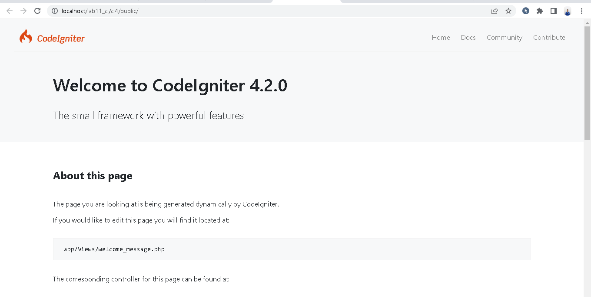
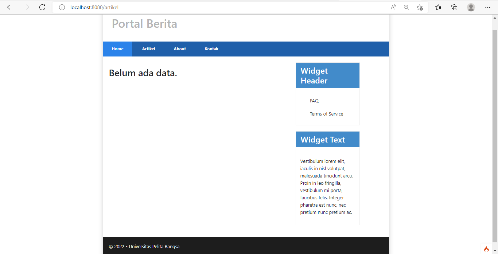
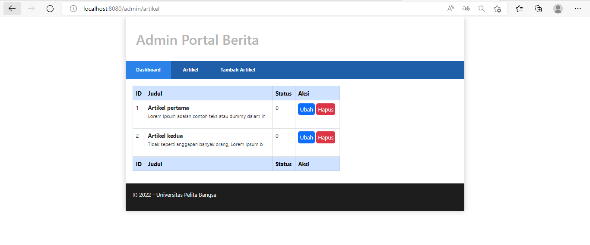
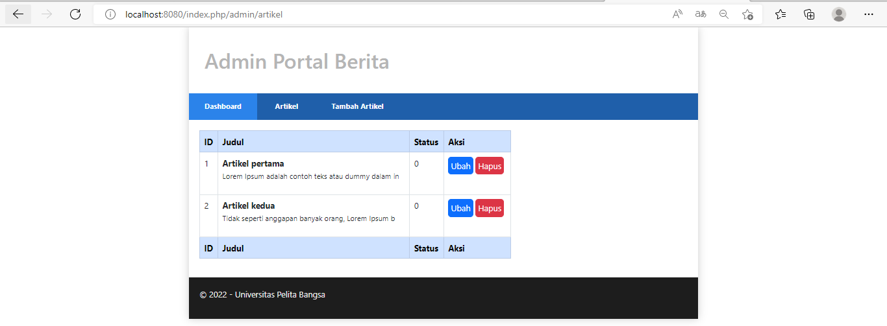
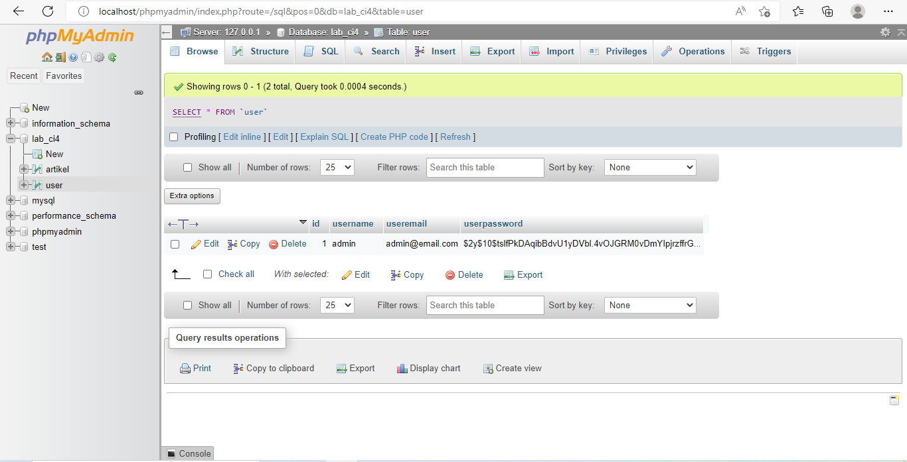

# LAB11

|  | |
| ----------- | ----------- |
| <b> Nama     | Aditya Bani Isro       |
| <b> NIM     | 312010134       |
| <b> Kelas   | TI.20.A.1        |
| <b> Matakuliah   | Pemrograman Web        |
| <b> Praktikum     | <a href="#p11">11</a>, <a href="#p12">12</a> & <a href="#p13">13</a></td>  |

<div id="p11">

# <spaan style="color: blue">Praktikum 11 | PHP Framework (Codeigniter)</span>

## Langkah langkah praktikum
## Persiapan
Sebelum memulai menggunakan Framework Codeigniter, perlu dilakukan konfigurasi
pada webserver. Beberapa ekstensi PHP perlu diaktifkan untuk kebutuhan
pengembangan Codeigniter 4.
Berikut beberapa ekstensi yang perlu diaktifkan:
- php-json ekstension untuk bekerja dengan JSON;
- php-mysqlnd native driver untuk MySQL;
- php-xml ekstension untuk bekerja dengan XML;
- php-intl ekstensi untuk membuat aplikasi multibahasa;
- libcurl (opsional), jika ingin pakai Curl.

Untuk mengaktifkan ekstentsi tersebut, melalu XAMPP Control Panel, pada bagian
Apache klik ``Config -> PHP.ini``


Pada bagian extention, hilangkan tanda ; (titik koma) pada ekstensi yang akan
diaktifkan. Kemudian simpan kembali filenya dan restart Apache web server.


## Instalasi  Codeigniter 4
Untuk melakukan instalasi Codeigniter 4 dapat dilakukan dengan dua cara, yaitu cara manual dan menggunakan composer. Pada praktikum ini kita menggunakan cara
manual.
- Unduh Codeigniter dari website https://codeigniter.com/download
- Extrak file zip Codeigniter ke direktori htdocs/lab11_ci.
- Ubah nama direktory framework-4.x.xx menjadi ci4.
- Buka browser dengan alamat http://localhost/lab11_ci/ci4/public/



## Menjalankan CLI (Command Line Interface)
Codeigniter 4 menyediakan CLI untuk mempermudah proses development. Untuk
mengakses CLI buka terminal/command prompt.


Arahkan lokasi direktori sesuai dengan direktori kerja project dibuat ``(xampp/htdocs/lab11_ci/ci4/)``.

Perintah yang dapat dijalankan untuk memanggil CLI Codeigniter adalah :
```
php spark
```


## Mengaktifkan Mode Debugging
- Ketik ``php spark serve`` pada CLI untuk menjalankan.


- Menampilkan pesan error, untuk mencobanya ubah kode file ``app/Controllers/home.php``, hapus ;nya.


- Ketik ``http://localhost:8080`` pada browser. Berikut tampilan error nya.


- Kemudian, ubah nama file ``env`` menjadi ``.env``. Masuk ke dalam filenya, hapus tanda ``#`` pada ``CI_ENVIRONMENT =``


- Refresh url sebelumnya, Berikut tampilan error nya.


## Struktur Direktori


## Routing and Controller
Router terletak pada file ``app/config/Routes.php``

## Membuat Route Baru
Tambahkan kode berikut di dalam ``Routes.php``
```php
$routes->get('/about', 'Page::about');
$routes->get('/contact', 'Page::contact');
$routes->get('/faqs', 'Page::faqs');
```


Untuk mengetahui route yang ditambahkan sudah benar, buka CLI dan jalankan
perintah berikut.
```
php spark routes
```


Selanjutnya coba akses route yang telah dibuat dengan mengakses alamat url http://localhost:8080/about


## Membuat Controller
Selanjutnya adalah membuat Controller Page. Buat file baru dengan nama ``page.php`` pada direktori Controller kemudian isi kodenya seperti berikut.
```php
<?php
namespace App\Controllers;
class Page extends BaseController
{
    public function about()
    {
        echo "Ini halaman About";
    }

    public function contact()
    {
        echo "Ini halaman Contact";
    }

    public function faqs()
    {
        echo "Ini halaman FAQ";
    }
}
```


Selanjutnya refresh Kembali browser, maka akan ditampilkan hasilnya yaitu halaman sudah dapat diakses.


- Auto Routing
Secara default fitur autoroute pada Codeiginiter sudah aktif. Untuk mengubah status autoroute dapat mengubah nilai variabelnya. Untuk menonaktifkan ubah nilai ``true`` menjadi ``false``.
```php
$routes->setAutoRoute(true);
```


Tambahkan method baru pada Controller Page seperti berikut.
```php
public function tos()
{
    echo "ini halaman Term of Services";
}
```


Method ini belum ada pada routing, sehingga cara mengaksesnya dengan menggunakan alamat: http://localhost:8080/page/tos


## Membuat View
Selanjutnya adalam membuat view untuk tampilan web agar lebih menarik. Buat file baru dengan nama ``about.php`` pada direktori view ``(app/view/about.php)`` kemudian isi kodenya seperti berikut.
```php
<!DOCTYPE html>
<html lang="en">
    <head>
        <meta charset="UTF-8">
        <title><?= $title; ?></title>
    </head>
    <body>
        <h1><?= $title; ?></h1>
        <hr>
        <p><?= $content; ?></p>
    </body>
</html>
```


Ubah ``method about`` pada class ``Controller Page`` menjadi seperti berikut:
```php
public function about()
{
    return view('about', [
        'title' => 'Halaman About',
        'content' => 'Ini adalah halaman abaut yang menjelaskan tentang isi halaman ini.'
        ]);
}
```


Kemudian lakukan refresh pada halaman tersebut.


## Membuat Layout Web dengan CSS
Buat file css pada direktori ``public`` dengan nama ``style.css`` (copy file dari praktikum ``lab4_layout``. Kita akan gunakan layout yang pernah dibuat pada praktikum 4.


Kemudian buat folder template pada direktori view kemudian buat file ``header.php`` dan ``footer.php``
```php
<!DOCTYPE html>
<html lang="en">
<head>
    <meta charset="UTF-8">
    <title><?= $title; ?></title>
    <link rel="stylesheet" href="<?= base_url('/style.css');?>">
</head>
<body>
    <div id="container">
        <header>
            <h1>Layout Sederhana</h1>
        </header>
        <nav>
            <a href="<?= base_url('/');?>" class="active">Home</a>
            <a href="<?= base_url('/artikel');?>">Artikel</a>
            <a href="<?= base_url('/about');?>">About</a>
            <a href="<?= base_url('/contact');?>">Kontak</a>
        </nav>
        <section id="wrapper">
            <section id="main">
```


File ``app/view/template/footer.php``


Kemudian ubah file ``app/view/about.php`` seperti berikut.
```php
<?= $this->include('template/header'); ?>
<h1><?= $title; ?></h1>
<hr>
<p><?= $content; ?></p>
<?= $this->include('template/footer'); ?>
```


Selanjutnya refresh tampilan pada alamat http://localhost:8080/about


# Pertanyaan dan Tugas
Lengkapi kode program untuk menu lainnya yang ada pada Controller Page, sehingga semua link pada navigasi header dapat menampilkan tampilan dengan layout yang sama.

# Jawaban
- Ubah isi pada Routes.php menjadi berikut,


- Pada ``Controllers/page.php``, menjadi berikut
```php
<?php
namespace App\Controllers;

class Page extends BaseController
{
    public function rumah()
    {
        return view('rumah', [
        'title' => 'Halaman Home',
        'content' => 'Ini adalah halaman home yang menjelaskan tentang isi
        halaman ini.'
        ]);
    }

    public function about()
    {
        return view('about', [
        'title' => 'Halaman About',
        'content' => 'Ini adalah halaman about yang menjelaskan tentang isi 
        halaman ini.'
        ]);
    }

    public function contact()
    {
        return view('contact', [
        'title' => 'Halaman Contact',
        'content' => 'Ini adalah halaman contact yang menjelaskan tentang isi 
        halaman ini.'
        ]);
    }

    public function artikel()
    {
        return view('artikel', [
        'title' => 'Halaman Artikel',
        'content' => 'Ini adalah halaman artikel yang menjelaskan tentang isi 
        halaman ini.'
        ]);
    }

    public function faqs()
    {
        return view('faqs', [
            'title' => 'Halaman FAQ',
            'content' => 'Ini adalah halaman FAQ yang menjelaskan tentang isi 
            halaman ini.'
            ]);
    }

    public function tos()
    {
        return view('tos', [
        'title' => 'Halaman TOS',
        'content' => 'Ini adalah halaman Terms of Service yang menjelaskan tentang isi 
        halaman ini.'
        ]);
    }
}
```

Pada masing-masing file di dalam Views, buat file baru denga nama : ``rumah.php``,``about.php``,``artikel.php``,``contact.php``,``faqs.php``, dan ``tos.php``. Masukan kode dibawah ini ke semua file tersebut
```php
    <?= $this->include('template/header'); ?>
    <h1><?= $title; ?></h1>
    <hr>
    <p><?= $content; ?></p>
    <?= $this->include('template/footer'); ?>
```
Untuk melihat hasilnya dengan menggunakan
alamat: http://localhost:8080/rumah


<div id="p12">

# <span style="color: blue">Praktikum 12 | Framework Lanjutan (CRUD)</span>

## 1. Database
- Jalankan ``Apache, MySql`` pada Xampp, Buat database dengan nama ``lab_ci4`` di http://localhost/phpmyadmin.
- Buat tabel dengan nama ``artikel``.
    ```sql
    CREATE TABLE artikel (
        id INT(11) auto_increment,
        judul VARCHAR(200) NOT NULL,
        isi TEXT,
        gambar VARCHAR(200),
        status TINYINT(1) DEFAULT 0,
        slug VARCHAR(200),
        PRIMARY KEY(id)
    );
    ```

<br>

## 2. Konfigurasi Koneksi Database
- Terletak di folder ``ci4``, file `.env`, Hapus tanda `#`.

<br>

## 3. Membuat Model 
- Terletak di folder `app/Models`, buat file `ArtikelModel.php`.

<br>

## 4. Membuat Controller 
- Terletak di folder `app/Controllers`, buat file `Artikel.php`.

<br>

## 5. Membuat View pada artikel 
- Terletak di folder `app/Views/artikel`, buat file `index.php`.

<br>

- Buka browser, ketik http://localhost:8080/artikel 

<br>

- Masukkan data ke tabel artikel,
    ```sql
    INSERT INTO artikel (judul, isi, slug) VALUE
    ('Artikel pertama', 'Lorem Ipsum adalah contoh teks atau dummy dalam industri 
    percetakan dan penataan huruf atau typesetting. Lorem Ipsum telah menjadi 
    standar contoh teks sejak tahun 1500an, saat seorang tukang cetak yang tidak 
    dikenal mengambil sebuah kumpulan teks dan mengacaknya untuk menjadi sebuah 
    buku contoh huruf.', 'artikel-pertama'), 
    ('Artikel kedua', 'Tidak seperti anggapan banyak orang, Lorem Ipsum bukanlah 
    teks-teks yang diacak. Ia berakar dari sebuah naskah sastra latin klasik dari 
    era 45 sebelum masehi, hingga bisa dipastikan usianya telah mencapai lebih 
    dari 2000 tahun.', 'artikel-kedua');
    ``` 

<br>

- Refresh kembali browser.

<br>

## 6. Membuat Tampilan detail Artikel
- Terletak di folder `app/Controllers`, edit file `Artikel.php`. Tambah method ``view()``.

<br>

## 7. Membuat View pada Detail
- Terletak di folder `app/Views/artikel`, buat file `detail.php`.

<br>

## 8. Membuat Routing untuk artikel detail
- Terletak di folder `app/Config`, edit file `Routes.php`.

<br>

- Klik `Artikel Kedua` pada http://localhost:8080/artikel, untuk pindah ke detailnya.

<br>

## 9. Membuat Menu admin
- Terletak di folder `app/Controller`, edit file `Artikel.php`. Tambah method `admin_index()`.

<br>

- Selanjutnya, akses kembali folder `app/Views/artikel`, buat file `admin_index.php`.
    ```php
    <?= $this->include('template/admin_header'); ?>
    <table class="table table-bordered table-hover">
        <thead>
            <tr class="table-primary">
                <th scope="col">ID</th>
                <th scope="col">Judul</th>
                <th scope="col">Status</th>
                <th scope="col">Aksi</th>
            </tr>
        </thead>
        <tbody>
            <?php if($artikel): foreach($artikel as $row): ?>
            <tr>
                <td><?= $row['id']; ?></td>
                <td>
                    <b><?= $row['judul']; ?></b>
                    <p><small><?= substr($row['isi'], 0, 50); ?></small></p>
                </td>
                <td><?= $row['status']; ?></td>
                <td>
                    <a class="btn btn-primary p-1" href="<?= base_url('/admin/artikel/edit/' . 
                    $row['id']);?>">Ubah</a>
                    <a class="btn btn-danger p-1" onclick="return confirm('Yakin menghapus data?');" href="<?= base_url('/admin/artikel/delete/' . 
                    $row['id']);?>">Hapus</a>
                </td>
            </tr>
            <?php endforeach; else: ?>
            <tr>
                <td colspan="4">Belum ada data.</td>
            </tr>
            <?php endif; ?>
        </tbody>
        <tfoot>
            <tr class="table-primary">
                <th scope="col">ID</th>
                <th scope="col">Judul</th>
                <th scope="col">Status</th>
                <th scope="col">Aksi</th>
            </tr>
        </tfoot>
    </table>
    <?= $this->include('template/admin_footer'); ?>
    ```
<br>

- Buka folder yang ada di ``app/Views/artikel/template``, kemudian buat:
- ``admin_header.php``,

<br>

- ``admin_footer.php``

<br>

## 10. Membuat Routing untuk menu admin
- Terletak di folder `app/Config`, edit file `Routes.php`.

<br>

- Akses browser dengan http://localhost:8080/admin/artikel.

<br>

## 11. Menambah data untuk Artikel
- Terletak di folder `app/Controller`, edit file `Artikel.php`. Tambah method `add()`.

<br>

- Akses kembali folder `app/Views/artikel`, buat file `form_add.php`.

<br>

- Akses browser dengan http://localhost:8080/admin/artikel/add.

<br>

## 12. Mengubah data pada Artikel
- Terletak di folder `app/Controller`, edit file `Artikel.php`. Tambah method `edit()`.

<br>

- Akses kembali folder `app/Views/artikel`, buat file `form_edit.php`.

<br>

- Akses browser dengan http://localhost:8080/admin/artikel/edit/1 untuk Mengubah artikel pertama.

<br>

## 13. Menghapus data pada Artikel
- Terletak di folder `app/Controller`, edit file `Artikel.php`. Tambah method `delete()`.

<br>

- Akses browser dengan http://localhost:8080/admin/artikel/add untuk membuat artikel ketiga, lalu `kirim`.

<br>

- Untuk mengeceknya ketik di url, http://localhost:8080/artikel kemudian enter.

<br>

- Pergi ke menu admin untuk menghapusnya, http://localhost:8080/admin/artikel, kemudian pilih `hapus`.

<br>

- Artikel berhasil dihapus.


<div id="p13">

# <span style="color: blue">Praktikum 13 | Framework Lanjutan (Modul Login)</span>

## 1. Membuat Table User
- Jalankan ``Apache, MySql`` pada Xampp, Akses browser http://localhost/phpmyadmin.
- Buat tabel dengan nama ``artikel``.
    ```sql
        CREATE TABLE user (
        id INT(11) auto_increment,
        username VARCHAR(200) NOT NULL,
        useremail VARCHAR(200),
        userpassword VARCHAR(200),
        PRIMARY KEY(id)
        );
    ```

<br>

## 2. Membuat Model User
- Terletak di folder `app/Models`, buat file `UserModel.php`.

<br>

## 3. Membuat Controller User
- Terletak di folder `app/Controllers`, buat file `User.php`.


## 4. Membuat View Login
- Terletak di folder `app/Views`, buat folder baru dengan nama `user`, buat file `login.php` di dalamnya.

<br>

## 5. Membuat Database Seeder
- Untuk keperluan uji coba.
- Masuk ke direktori ci4, kemudian ketikkan kode:
``php spark make:seeder UserSeeder``

<br>

- Terletak di folder `app/Database/Seeds`, buka file `UserSeeder.php`, kemudian edit menjadi berikut:

<br>

- Buka kembali CLI, kemudian ketik perintah berikut:
``php spark db:seed UserSeeder``

<br>

- Berikut data yang sudah ditambah pada tabel `user`. Dengan mengakses ``http://localhost/phpmyadmin``.

<br>

- Buka file `.env`, kemudian hapus `#` pada `app.sessionX`

<br>

- Akses kembali url ``http://localhost:8080/user/login``

<br>

## 6. Menambah Auth Filter
- Terletak di folder `app/Filters`, buat file `Auth.php`

<br>

- Kemudian pada folder `app/Config`, edit isi file `Filters.php` menjadi berikut:

<br>

- Juga berikut

<br>

- Untuk mencobanya, akses ``http://localhost:8080/artikel``, kemudian tambah menjadi ``http://localhost:8080/admin/artikel`` lalu tekan enter.

<br>

- Otomatis akan dialihkan untuk login terlebih dahulu.

- Mencoba masuk dengan email `admin@email.com`, dan password `admin123`, kemudian tekan `login`.

<br>

- Berhasil masuk sebagai admin, dan semua menu dapat diakses.Untuk mencobanya klik menu `Artikel`.

<br>

- Kemudian klik menu `Login Admin`, untuk diarahkan ke ``http://localhost:8080/admin/artikel``.

<br>

- Maka akan masuk ke menu admin sebelumnya, tidak login ulang.

<br>

## 7. Membuat Fungsi Logout
- Menambah method logout().
- Terletak di folder `app/Controllers`, buka file `User.php`, kemudian edit menjadi berikut:

<br>

- Untuk mencobanya, klik menu `Logout`.

<br>

- Maka akan langsung diarahkan untuk login ulang, sebelum bisa mengakses menu admin.

<br>

- Namun, untuk ``http://localhost:8080/artikel`` masih dapat diakses.

<br>

</div>